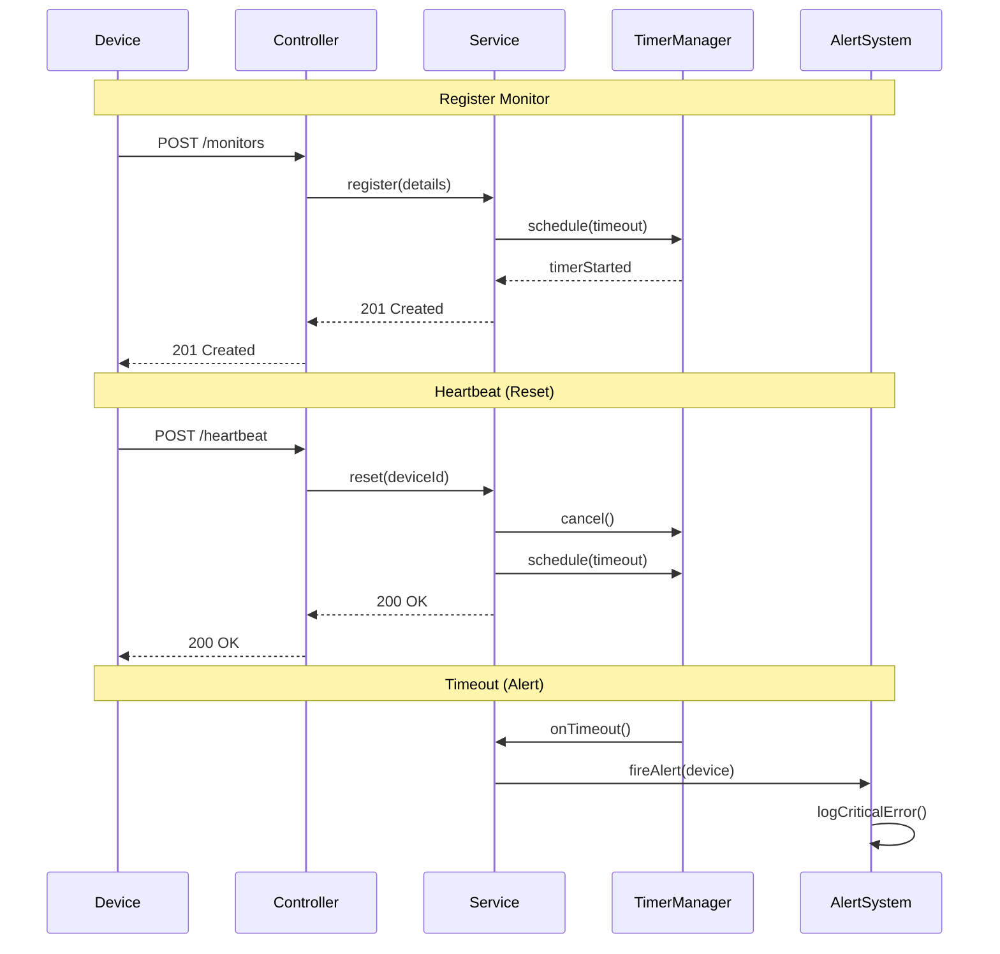
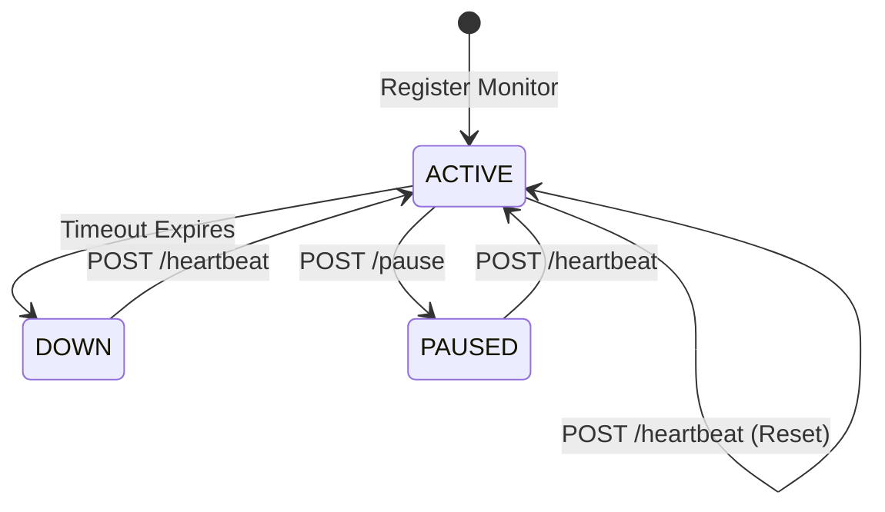

# Pulse Check API - Watchdog Sentinel

A Dead Man's Switch API for monitoring remote devices. Devices register with a timeout period and must send heartbeats before the timer expires, or an alert is triggered.

## Architecture

### Logic Flow (Sequence Diagram)



### State Diagram



---

## Quick Start

### Prerequisites
- **Java 17** or higher
- **Maven 3.6+**
- **Database**: H2 (In-memory for testing) or PostgreSQL (Production)

### How to Run
1. **Clone the repository**
```bash
git clone <your-repo-url>
cd pulse-check-api
```

2. **Start the application**
```bash
mvn spring-boot:run
```
The API will start on `http://localhost:8080`

3. **Test the API** (optional)
```bash
# On Linux/Mac
./test-api.sh

# On Windows
test-api-windows.bat
```

### Database Setup
1. By default, the application uses **H2 In-Memory** database for easy testing.
2. For PostgreSQL, update `src/main/resources/application.properties` with your credentials.
3. Tables are created automatically on startup.

### Run the Application
The API will start on `http://localhost:8080` after running `mvn spring-boot:run`

---

## API Documentation

### 1. Register a Monitor
Create a new watchdog timer for a device.
- **Endpoint**: `POST /monitors`
- **Body**:
```json
{
  "id": "device-123",
  "timeout": 60,
  "alert_email": "admin@critmon.com"
}
```
- **Response**: `201 Created`

### 2. Send Heartbeat
Reset the countdown timer.
- **Endpoint**: `POST /monitors/{id}/heartbeat`
- **Behavior**: If paused, it automatically resumes monitoring.
- **Response**: `200 OK`

### 3. Pause Monitor
Temporarily stop monitoring (e.g., for maintenance).
- **Endpoint**: `POST /monitors/{id}/pause`
- **Response**: `200 OK`

### 4. Get All Down Monitors (Developer's Choice)
List all devices that have timed out and are currently offline.
- **Endpoint**: `GET /monitors/down`
- **Response**: `200 OK` (JSON Array of Monitors)

### 5. Get Monitor Status
Check the current state of a specific device.
- **Endpoint**: `GET /monitors/{id}`
- **Response**: `200 OK`

---

## Developer's Choice: Enhanced Reliability & Visibility

I added two specific features to make the system more robust:

1.  **Auto-Resume on Heartbeat**:
    - **Problem**: Technicians often forget to "unpause" a device after maintenance.
    - **Solution**: The system automatically resumes monitoring the moment a heartbeat is received, ensuring no device is left unmonitored indefinitely.

2.  **Down Devices Dashboard Endpoint (`/monitors/down`)**:
    - **Problem**: Support teams need a quick way to see *all* failing devices without checking logs.
    - **Solution**: A dedicated endpoint that returns a list of all monitors currently in the `DOWN` state.

---

## Project Structure
- `controller/`: REST endpoints using specific, human-readable naming.
- `service/`: Core business logic and timer management.
- `model/`: Monitor entity and status definitions.
- `dto/`: Clean data transfer objects for API requests/responses.
- `recovery/`: Automatic timer resumption after application restarts.
