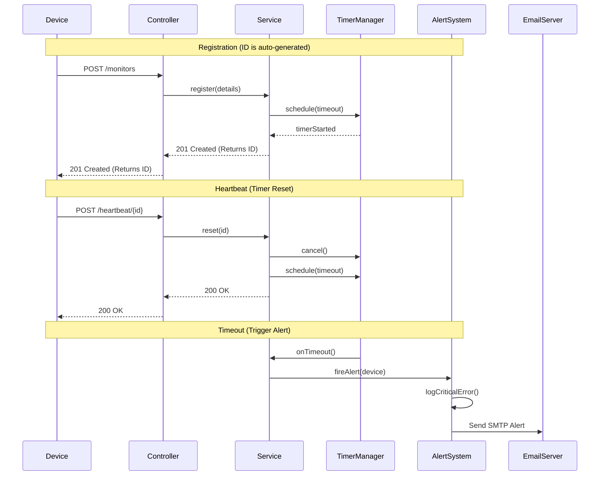
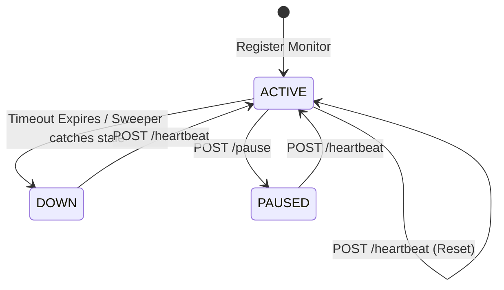

# Pulse Check API - Watchdog Sentinel

Pulse Check is a specialized backend service designed to act as a "Dead Man's Switch" for remote monitoring infrastructure. It provides real-time tracking for devices that must maintain periodic communication to prove they are still operational.

The system is built to handle scenarios where remote devices (like weather stations or solar farms) might go offline due to power loss or hardware failure without being able to send a final "goodbye" signal.

## System Architecture

The core of the system relies on high-performance in-memory timers backed by a persistent database state to ensure reliability even across application restarts.

### Logic Flow

The following diagram illustrates how a device interacts with the sentinel to maintain its active status.



### State Management

Each monitor moves through a set of predefined states based on device activity and administrative actions.



## 🛠️ Getting Started

### Prerequisites

You will need the following tools installed on your machine:
- **Java 17** Development Kit (JDK)
- **Maven 3.6** or higher
- A running **PostgreSQL** instance (only required for the production profile)

### Configuration (.env)

The system is designed to be secure. We use a `.env` file to store sensitive credentials so they are never pushed to GitHub.

1. Create a `.env` file in the root directory.
2. Add your SMTP credentials:
   ```env
   SPRING_MAIL_USERNAME=your-email@gmail.com
   SPRING_MAIL_PASSWORD=your-16-digit-app-password
   ```

### Running the Application

For local development using an in-memory H2 database:

**Windows (PowerShell):**
```powershell
# Loads .env variables and starts the app
Get-Content .env | Foreach-Object { $name, $value = $_.split('='); [System.Environment]::SetEnvironmentVariable($name, $value) }; .\mvnw spring-boot:run
```

**Linux/Mac:**
```bash
export $(xargs <.env) && ./mvnw spring-boot:run
```

## 📡 API Specification

### 1. Register a New Monitor
Registers a device. The server will assign a unique numeric ID.
- **URL**: `POST /monitors`
- **Payload**:
```json
{
  "timeout": 60,
  "alert_email": "admin@example.com"
}
```
- **Response**:
```json
{
  "message": "Monitor created successfully with ID: 1"
}
```

### 2. Device Heartbeat
Resets the timer for a specific device. If the device was previously paused, it will automatically resume.
- **URL**: `POST /monitors/{id}/heartbeat`

### 3. Pause Monitoring
Temporarily stops the watchdog timer for a device. Useful for scheduled maintenance.
- **URL**: `POST /monitors/{id}/pause`

### 4. Fetch Offline Devices
Returns a list of all devices that are currently in the **DOWN** state.
- **URL**: `GET /monitors/down`

### 5. Check Monitor Details
Retrieves the full status and metadata for a specific monitor.
- **URL**: `GET /monitors/{id}`

## 🛡️ Enhanced Robustness (Developer's Choice)

### Stale Monitor Sweeper (The Safety Net)
Primary heartbeat tracking relies on high-speed in-memory timers. However, to ensure 100% reliability, the **StaleMonitorSweeperService** runs every 60 seconds as a background safety net. It queries the database for any monitor marked as ACTIVE that has missed its window but lacks a live timer (e.g., after a crash), ensuring no device "falls through the cracks."

### Automatic Maintenance Resume
Technicians often forget to "unpause" a device after maintenance. Our system automatically resumes monitoring the moment any heartbeat is received for a paused device, ensuring the "human element" doesn't compromise safety.

## 📁 Project Structure

Organized into descriptive packages following standard Spring Boot conventions:

- **api**: REST controllers and request handling.
- **domain**: JPA entities and core data models.
- **dto**: Data Transfer Objects for API requests/responses.
- **service**: Business logic (Timer management, Alerting, Sweeper).
- **repository**: Database access layer (Spring Data JPA).
- **exception**: Centralized error handling.
